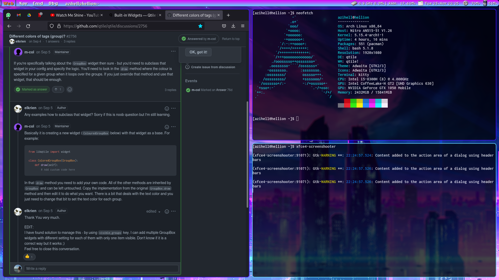
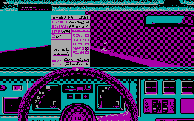

# My *[dotfiles](https://wiki.archlinux.org/title/Dotfiles)*!

## What is this repo for?
This repo function is twofold:

1) It is a way to help me backup my custom *dotfiles*, by storing them. They are listed in the section [Dotfiles](#dotfiles).
2) It keeps the `dotfiles_list` in it, which is a file that makes `rsync` usage more practical. The `dotfiles_list` contains the paths to many *dotfiles* (both `rsync` and these *dotfiles* are explained, follow along).
3) Since a lot of explaining is supposed to happen here in order to make things work, this **README.md** will probably contain a lot of GitHub's markdown features, so feel free to take a look at the "raw" version of this file!

### But what are *dotfiles*?
Many Linux applications store their settings into hidden files. This repo gathers a lot of them into one place, for easier management, and one way to more easily do this is by using the `rsync` application, which is explained below. Since many applications (and even basic Linux functionalities can be set, as it can be seen in `.bashrc`files), if you gather lots of dotfiles for lots of applications, you'll end up setting up and customizing your own full fledged desktop environment!

### And what is `rsync`?
`rsync` is an application that in it's most simple usage synchronizes the contents of a path, recursively or not, to another path. Since the files I need copied are many, they are listed in the `dotfile_list`. This way I can gather many scattered files throughout the system into one place and make a repository with all of my settings.

*Attention*: if the `--dry-run` parameter is used no real syncing will happen, but the expected outcome will be shown. *That's **always** kinda a great idea.*
  
### rsyncing the files scattered along many paths into the *dotfiles* folder:
  
```console
user@pc $ cd dotfiles
user@pc $ rsync -vr --dry-run --files-from=dotfiles_list $HOME "<destination>"
  # If everything is ok, then:
user@pc $ rsync -vr --files-from=dotfiles_list $HOME "<destination>"
```
This basically tells `rsync` to look for the files to sync in a list, which is represented by the file `dotfiles_list`, and sync (*copy them in a smart way*) them to the `"<destination>"` path.


## Dotfiles

- [x] .xprofile: startup commands for X11 desktop.
- [x] [fish](https://fishshell.com/): shell to replace the ubiquitous [BASH](https://tiswww.case.edu/php/chet/bash/bashtop.html).
  - [oh-my-fish](https://github.com/oh-my-fish/oh-my-fish) - `.fish` script that installs fish packages which extend or modify the `fish` shell.
- [x] [Nitrogen](https://wiki.archlinux.org/title/nitrogen): simple wallpaper manager.
- [x] [Picom](https://wiki.archlinux.org/title/Picom): window composer. Blur, opacity, rounded corners and more for your desktop environment.
  - Restarting *Picom*: it's automatic.
- [x] [Qtile](https://wiki.archlinux.org/title/Qtile): Python tiling manager.
  - Restarting *Qtile*: <kbd>Super+Ctrl+R</kbd>.
- [x] [Kitty](https://wiki.archlinux.org/title/Kitty): a terminal emulator.
  - Restarting *Kitty*: <kbd>Ctrl+Shift+F5</kbd>.
- [x] [Neovim](https://github.com/neovim/neovim): a new take on [Vim](https://github.com/vim/vim).
  - The file has settings as well as plugin declarations that are used along with [vim-plug](https://github.com/junegunn/vim-plug).
- [x] [ranger](https://github.com/ranger/ranger): a file explorer that builds its interface straight from the console (or terminal emulator) and uses [Vim](https://github.com/vim/vim) key settings.
  - When used with *Kitty* terminal, it can also preview pictures!

## Desktop screenshot



For now, I'm thinking of this neon-like theme for the colors, wallpapers and the retro font styles.. Coincidentally (?) it kind of matches the color of first game I ever played, "Test Drive" from Accolade, Inc.


